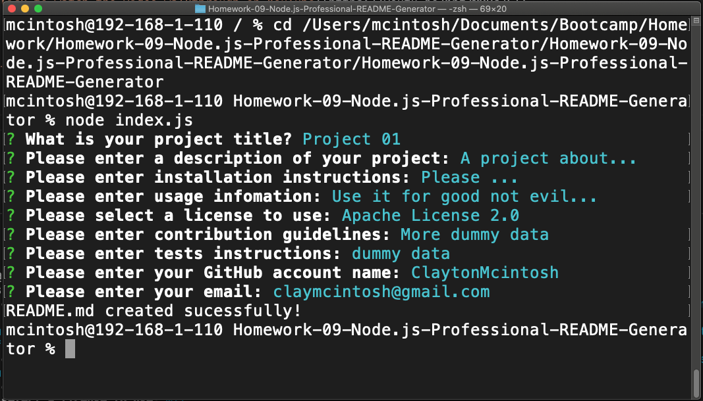

# Node.js Professional README Generator

## Task

This project was my first Node.js project. It was a lot of fun and quite satisfying to create the README.md document at the end. It was a bit of a challenge stepping away from the browser and trying to think about the project more as a program than a website. I found the project came together rather quickly as it was very similar to the mini project we did in class. Not only was it a fun project, I am actually using it now to create this README.md file.

## User Story

```
AS A developer
I WANT a README generator
SO THAT I can quickly create a professional README for a new project
```

## Acceptance Criteria

```
GIVEN a command-line application that accepts user input
WHEN I am prompted for information about my application repository
THEN a high-quality, professional README.md is generated with the title of my project and sections entitled Description, Table of Contents, Installation, Usage, License, Contributing, Tests, and Questions
WHEN I enter my project title
THEN this is displayed as the title of the README
WHEN I enter a description, installation instructions, usage information, contribution guidelines, and test instructions
THEN this information is added to the sections of the README entitled Description, Installation, Usage, Contributing, and Tests
WHEN I choose a license for my application from a list of options
THEN a badge for that license is added near the top of the README and a notice is added to the section of the README entitled License that explains which license the application is covered under
WHEN I enter my GitHub username
THEN this is added to the section of the README entitled Questions, with a link to my GitHub profile
WHEN I enter my email address
THEN this is added to the section of the README entitled Questions, with instructions on how to reach me with additional questions
WHEN I click on the links in the Table of Contents
THEN I am taken to the corresponding section of the README
```

## Video Walkthrough

[Click to watch the video walkthrough on YouTube](https://youtu.be/Kpf7NDUsJEI)

## Sample of README.md file

[Click to see a sample file, created in the Node.js application](./sampleREADME.md)

## Screenshot

Here is a screenshot of the program running from terminal:



## Questions

If you have any questions, you can reach me on my [GitHub account](https://github.com/ClaytonMcintosh) or at my [email](mailto:domesticcowboy@gmail.com).
